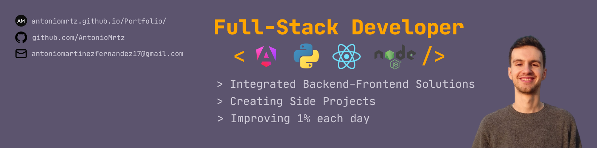

# 👋 Hi, I'm **Antonio Martínez** — Full-Stack Developer

Full-Stack Developer focused on:

- Building integrated frontend–backend solutions
- Trying to improve 1% each day
- Building side projects based on challenges I encounter or tools I wish existed.
- Staying up to date with the latest tech trends 

## 🧰 Tech Stack

<table>
	<tr>
		<th>Backend</th>
		<th>Frontend</th>
		<th>Database</th>
	</tr>
	<tr>
		<td>
			

				
					
					
				
				
					Python + 
					FastAPI
				
			

		</td>
		<td>
			

				
					
				
				Angular
			

		</td>
		<td>
			

				
					
				
				PostgreSQL
			

		</td>
	</tr>
	<tr>
		<td>
			

				
					
					
				
				
					Node.js + 
					NestJS
				
			

		</td>
		<td>
			

				
					
				
				React
			

		</td>
		<td>
			

				
					
				
				MongoDB
			

		</td>
	</tr>
	<tr>
		<td>
			

				
					
				
				Java
			

		</td>
		<td>
			

				
					
				
				Astro
			

		</td>
		<td>
			

				
					
				
				Redis
			

		</td>
	</tr>
</table>

## 🌐 Languages

	
	

## 🔗 Contact & Links

- 🌐 **Portfolio:** https://antoniomrtz.github.io/Portfolio/  
- 💼 **LinkedIn:** https://www.linkedin.com/in/antonio-martinez-fernandez-dev/  
- 🐙 **GitHub:** https://github.com/AntonioMrtz  

## 🏃‍♂️ Beyond Coding

I enjoy outdoor sports such as trail running and cycling, often taking part in competitions.  
Music is a big part of my life—I’m always looking for new genres and fresh artists.
